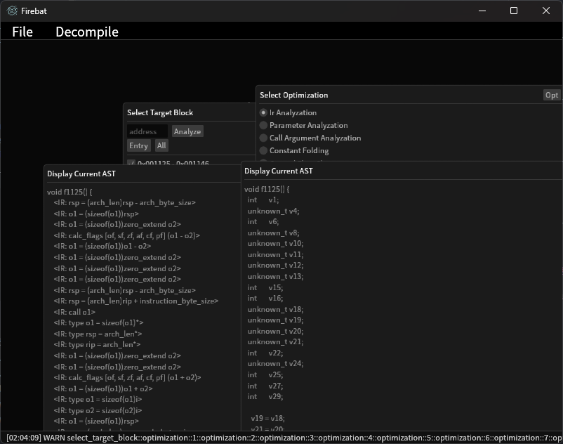
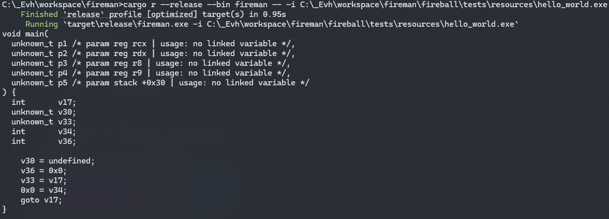
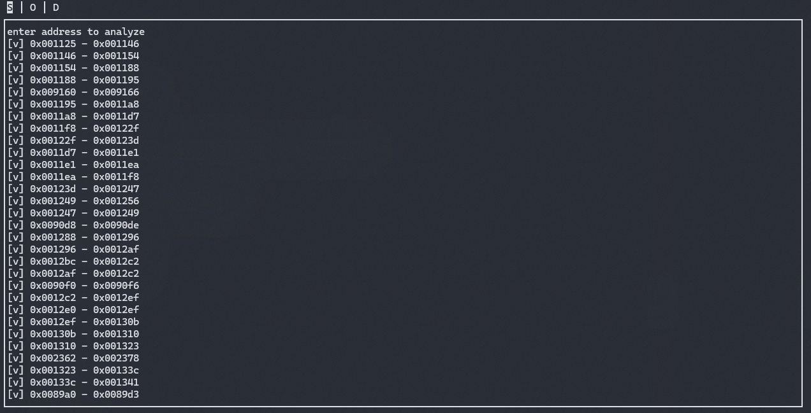
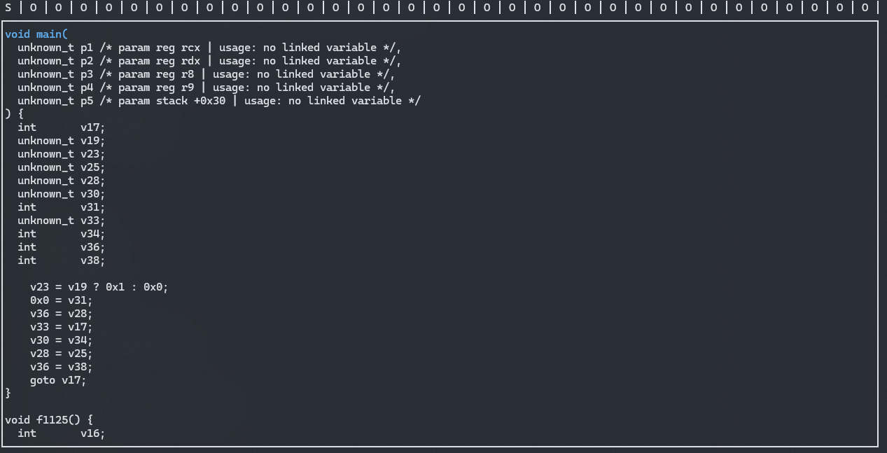

# Fireman

## Why fireman?

While using snowman back in high school, I often imagined a decompiler that would allow me to manually tweak the Intermediate Representation (IR) through a GUI and see the C decompilation results update accordingly. fireman is the realization of that dream, more than a decade later. Because this project is the fulfillment of a long-held personal vision, I chose to build it as a standalone tool rather than a plugin for existing decompilers.

## GUI

## CLI

## TUI

## Features & Plans

- [x] Generate IR Based Environment
- [X] Complete Instruction Parsing Routine
  - [X] X64
    - [X] Copy All Instruction Documents
    - [X] Complete Instruction Parsing Function
  - [ ] ARM
  - [ ] ...
- [X] IR Based Analyzed Routine
  - [X] Single Block Variable Analysis (aka Data Flow Analysis)
    - [X] Reaching Definitions Analysis
    - [X] Liveness Analysis
  - [X] Control Flow Analysis
    - [ ] Complex Loop Analysis
  - [X] Merged Block Variable Analysis
- [ ] Simulation Routine
  1. simulate asm block with argument with unicorn then mapping and display member value of ir and ast
  2. change some asm with keystone for a faster simulation routine
- [X] Generate C like Code
  - [X] Optimization
- [x] GUI decompiler
  - [x] Inspect IR
  - [ ] Modify IR or Instruction
  - [x] Generate C like Code
  - [ ] Simulate With Memory / Register
- [X] TUI decompiler
- [X] CLI decompiler
- [X] IR Pattern Matching Routine (to detect well-known library's function like msvc's memcpy)
- [ ] Optimizer
- [ ] Deobfucasioner (possible?)

## Code style

### Comment Template (optional, to avoid typing Note, NOTE, NOTES, notes, ....)

- \#\#\# Arguments
- \#\#\# Returns
- \#\#\# Note
- \#\#\# Todo
