# Fireman Decompiler - Architecture & Structure Diagrams

## High-Level Architecture

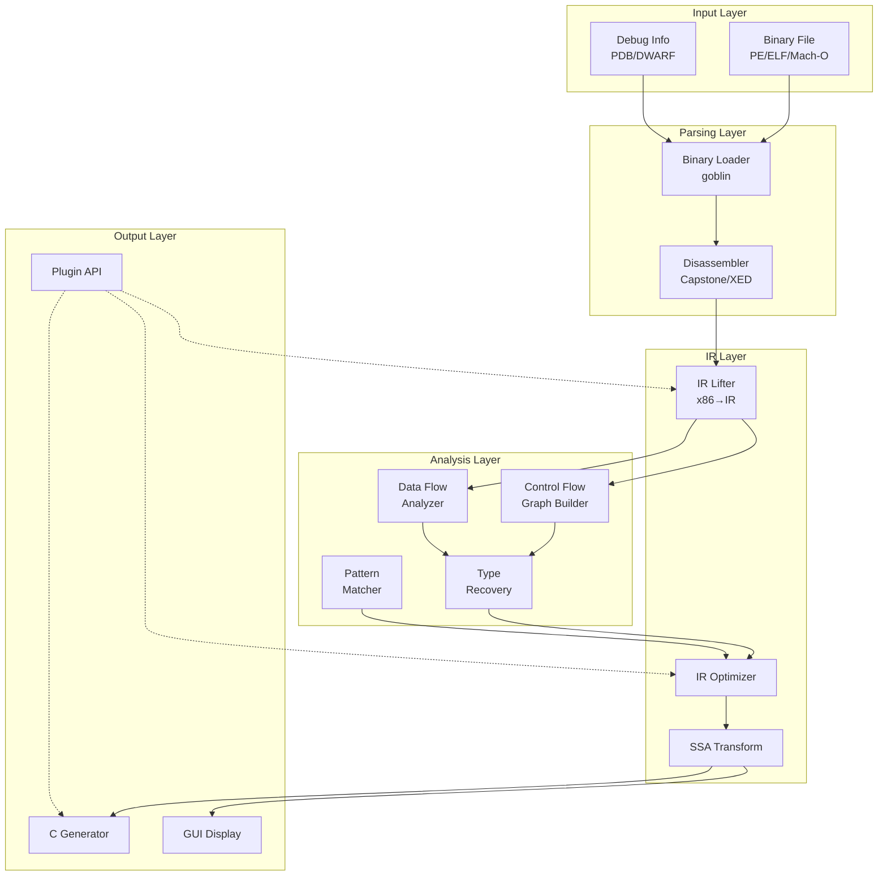

## Decompilation Pipeline

```mermaid
flowchart LR
    subgraph "Stage 1: Decoding"
        A1[Raw Bytes] --> A2[Instruction<br/>Decoder]
        A2 --> A3[Basic<br/>Blocks]
    end

    subgraph "Stage 2: Lifting"
        A3 --> B1[IR<br/>Generation]
        B1 --> B2[Flag<br/>Elimination]
        B2 --> B3[Stack<br/>Analysis]
    end

    subgraph "Stage 3: Analysis"
        B3 --> C1[Data Flow<br/>Analysis]
        C1 --> C2[Type<br/>Inference]
        C2 --> C3[Variable<br/>Recovery]
    end

    subgraph "Stage 4: Optimization"
        C3 --> D1[Dead Code<br/>Elimination]
        D1 --> D2[Expression<br/>Simplification]
        D2 --> D3[Pattern<br/>Recognition]
    end

    subgraph "Stage 5: Generation"
        D3 --> E1[Control Flow<br/>Structuring]
        E1 --> E2[C Code<br/>Generation]
        E2 --> E3[Pretty<br/>Printing]
    end
```

## IR Structure

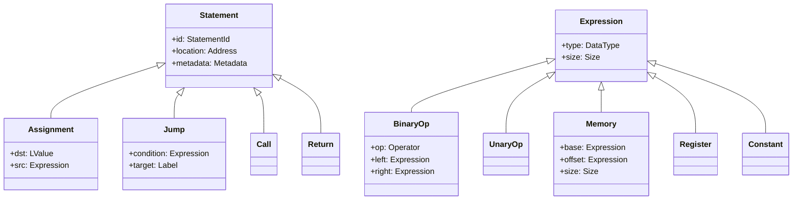

## Control Flow Graph Structure

```mermaid
graph TD
    subgraph "Function CFG"
        ENTRY[Entry Block]
        BB1[Basic Block 1<br/>mov eax, [ebp+8]<br/>test eax, eax]
        BB2[Basic Block 2<br/>je .error]
        BB3[Basic Block 3<br/>call validate<br/>test eax, eax]
        BB4[Basic Block 4<br/>mov eax, 1<br/>ret]
        ERROR[Error Block<br/>xor eax, eax<br/>ret]
        EXIT[Exit Block]
    end

    ENTRY --> BB1
    BB1 --> BB2
    BB2 -->|condition: ZF=1| ERROR
    BB2 -->|condition: ZF=0| BB3
    BB3 --> BB4
    BB4 --> EXIT
    ERROR --> EXIT

    style ENTRY fill:#90EE90
    style EXIT fill:#FFB6C1
    style ERROR fill:#FFA07A
```

## Data Flow Analysis

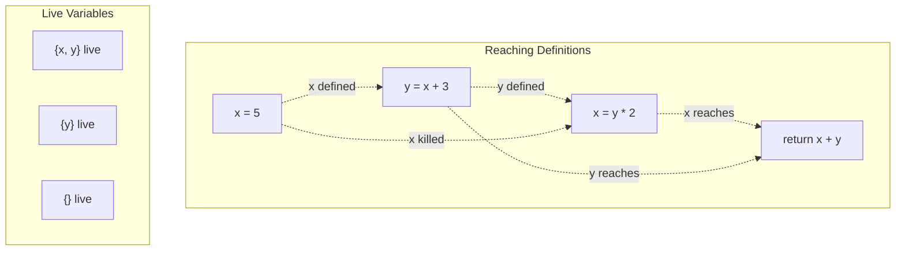

## Type Recovery Process

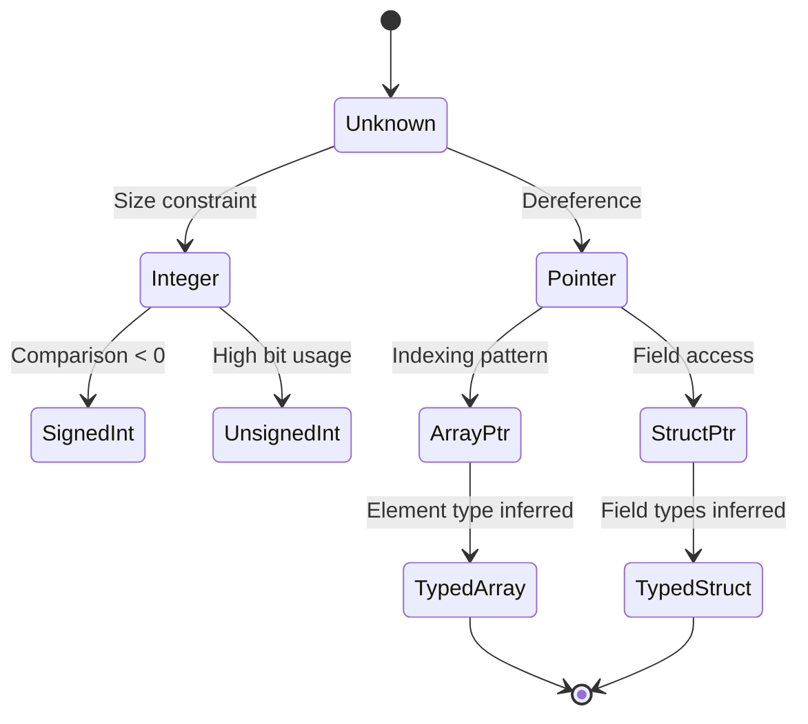

## Pattern Matching System

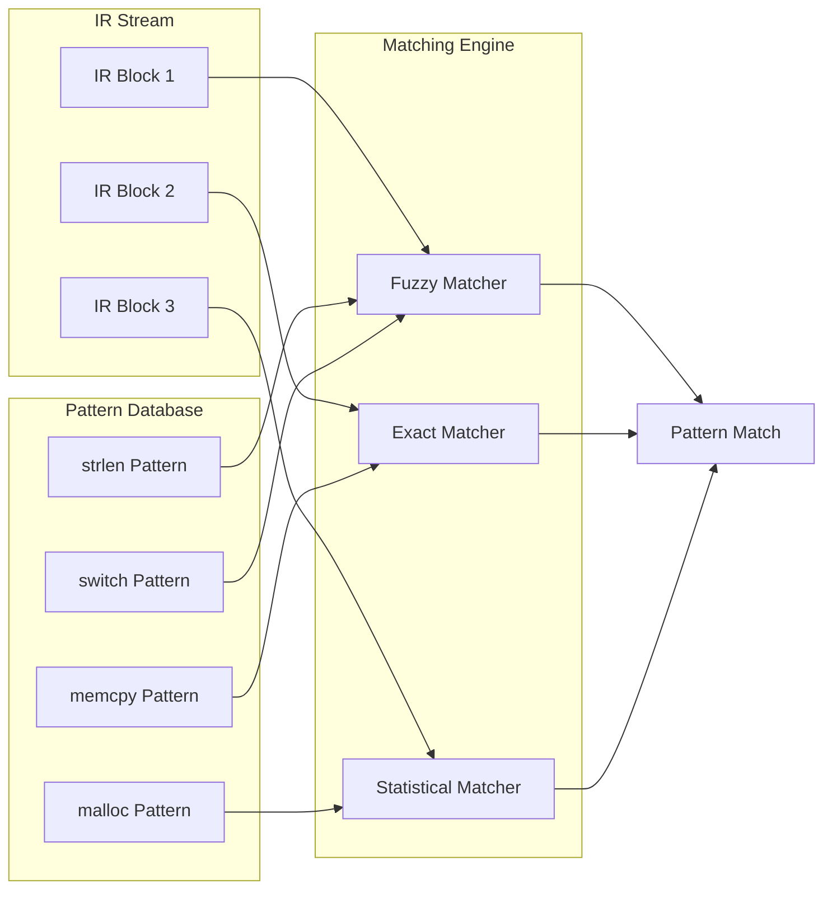

## Memory Model

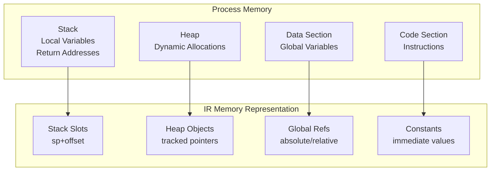

## Plugin Architecture

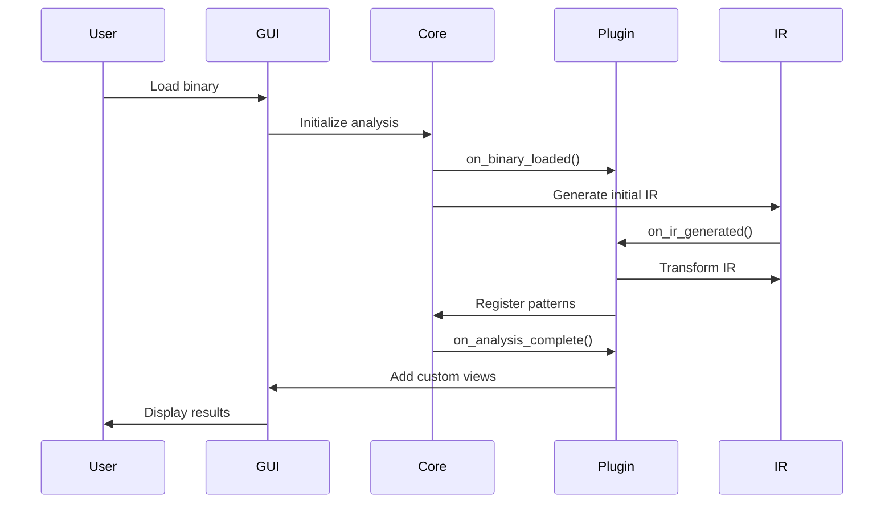

## Optimization Pipeline

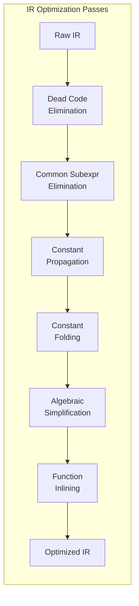

## Error Recovery Strategy

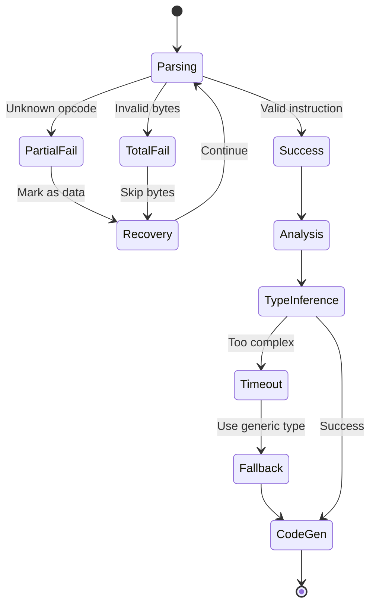

## Component Dependencies

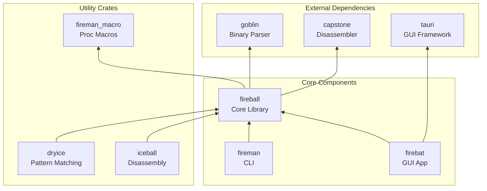

## Performance Architecture

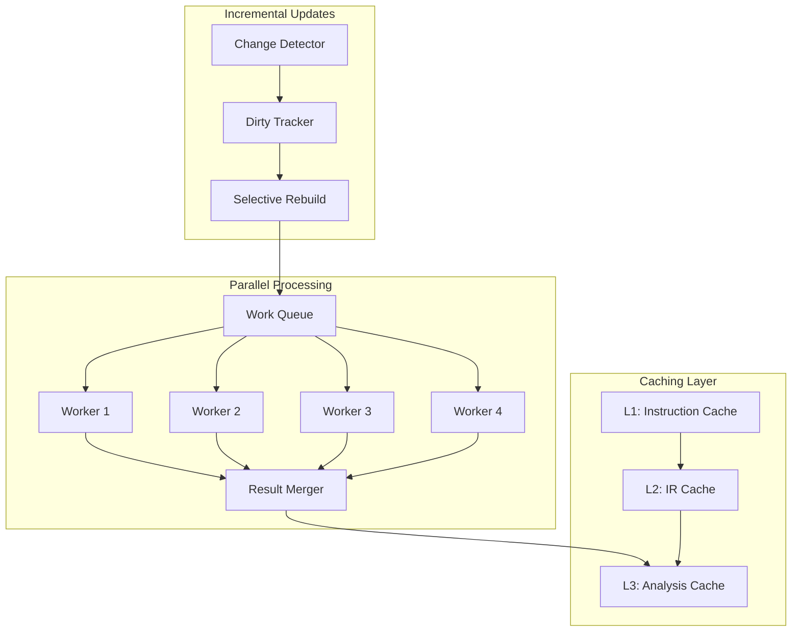

## Summary

These diagrams illustrate Fireman's architecture from multiple perspectives:

1. **Data Flow**: How binary data transforms into C code
2. **Component Structure**: How different parts interact
3. **Analysis Algorithms**: How we recover high-level information
4. **Performance Design**: How we achieve speed goals
5. **Error Handling**: How we deal with real-world binaries

The key insight is that decompilation is not just "disassembly in reverse" - it's a complex process of information recovery, pattern recognition, and intelligent transformation. Our architecture is designed to make this process fast, accurate, and extensible.