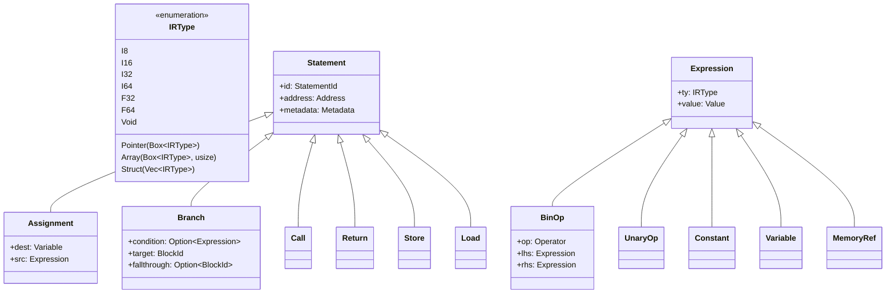

# Fireman Decompiler - Reformed Architecture & Structure Diagrams

## Current Architecture Overview

```mermaid
graph TB
    subgraph "Input Layer"
        BINARY[Binary Files<br/>PE/ELF/Mach-O]
        BYTES[Raw Bytes]
    end

subgraph "Binary Format Layer"
PE[PE Parser<br/>binary/pe/]
ELF[ELF Parser<br/>binary/elf/]
MACHO[Mach-O Parser<br/>binary/macho/]
AUTODETECT[Format Detection<br/>Magic Bytes]
end

subgraph "Architecture Layer"
X86_64[x86_64<br/>✅ Implemented]
X86[x86<br/>🚧 Planned]
ARM32[ARM32<br/>🚧 Planned]
ARM64[ARM64<br/>🚧 Planned]
ARCHDETECT[Arch Detection]
end

subgraph "Core Components"
FIRE[Fire Trait<br/>Main Interface]
FIRERAW[FireRaw<br/>Low-level Ops]
BLOCKS[Blocks<br/>Basic Blocks]
INSTR[Instructions]
ADDR[Addressing<br/>VMA/File]
end

subgraph "Multi-Level IR"
LOWIR[Low IR<br/>Direct Translation]
MEDIUMIR[Medium IR<br/>Pattern Recognition]
HIGHIR[High IR<br/>Structured Code]
end

subgraph "Analysis Pipeline"
CFG[CFG Construction]
DFA[Data Flow Analysis]
TYPE[Type Recovery]
VAR[Variable Analysis]
STRUCT[Struct Reconstruction]
LOOP[Loop Analysis]
end

subgraph "Output Layer"
ENHANCEDC[Enhanced C<br/>Modern Features]
GUI[GUI Display<br/>Tauri/React]
CLI[CLI Output]
end

BINARY --> AUTODETECT
BYTES --> AUTODETECT
AUTODETECT --> PE & ELF & MACHO
PE & ELF & MACHO --> ARCHDETECT
ARCHDETECT --> X86_64 & X86 & ARM32 & ARM64
X86_64 --> FIRE
FIRE --> FIRERAW
FIRERAW --> BLOCKS & INSTR & ADDR
BLOCKS --> LOWIR
LOWIR --> MEDIUMIR
MEDIUMIR --> HIGHIR
LOWIR & MEDIUMIR & HIGHIR --> CFG & DFA & TYPE & VAR & STRUCT & LOOP
HIGHIR --> ENHANCEDC
ENHANCEDC --> GUI & CLI

style X86_64 fill: #90EE90
style X86 fill: #FFE4B5
style ARM32 fill:#FFE4B5
style ARM64 fill: #FFE4B5
```

## Multi-Level IR Architecture

## IR Type System

## Analysis Pipeline Detail

## Deterministic Processing Architecture

## Enhanced C Generation System

## Current Implementation Status

## Memory Model and Representations

## Testing Architecture

## Workspace Dependencies

## Key Architectural Decisions

### 1. **Determinism First**

- Every operation must be reproducible
- Sorted data structures throughout
- No randomness or time-dependent behavior

### 2. **Multi-Level IR**

- Gradual abstraction from machine code to source
- Preserve semantics at each level
- Enable targeted optimizations

### 3. **Enhanced C Output**

- Modern C features for readability
- Confidence-based feature selection
- Maintain decompiler characteristics

### 4. **Extensible Architecture**

- Trait-based design for formats/architectures
- Clear separation of concerns
- Plugin system planned for customization

### 5. **Performance Focus**

- Zero-copy where possible
- Parallel analysis capabilities
- Efficient memory usage

## Future Roadmap

1. **Near Term**
    - Complete x86_64 instruction coverage
    - Finish ELF/Mach-O parsers
    - Improve pattern matching

2. **Medium Term**
    - ARM architecture support
    - Advanced optimization passes
    - Symbol resolution

3. **Long Term**
    - Plugin system
    - Cloud-based analysis
    - Machine learning integration

This reformed architecture represents the current state of the Fireman decompiler, focusing on practical implementation
while maintaining the vision of a high-performance, deterministic decompilation framework.
