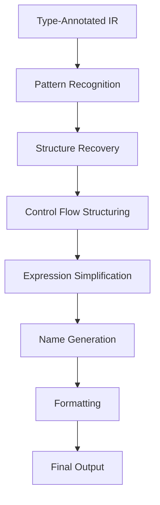

# C Output Generation Strategy

## Overview

This document describes how to generate readable C-like code from the decompiler's IR, focusing on producing output that is both accurate and human-friendly.

## Output Generation Pipeline



## Implementation in Rust

### 1. AST Representation

```rust
use std::fmt::{self, Display, Write};

/// C-like Abstract Syntax Tree
#[derive(Debug, Clone)]
pub enum CStatement {
    /// Variable declaration
    Declaration {
        type_spec: CType,
        name: String,
        initializer: Option<Box<CExpr>>,
        confidence: Confidence,
    },
    
    /// Expression statement
    Expression(Box<CExpr>),
    
    /// Assignment
    Assignment {
        lvalue: Box<CExpr>,
        rvalue: Box<CExpr>,
        confidence: Confidence,
    },
    
    /// Control flow
    If {
        condition: Box<CExpr>,
        then_block: Vec<CStatement>,
        else_block: Option<Vec<CStatement>>,
        confidence: Confidence,
    },
    
    /// Loops
    For {
        init: Option<Box<CStatement>>,
        condition: Option<Box<CExpr>>,
        update: Option<Box<CExpr>>,
        body: Vec<CStatement>,
        confidence: Confidence,
    },
    
    While {
        condition: Box<CExpr>,
        body: Vec<CStatement>,
        confidence: Confidence,
    },
    
    /// Low-confidence constructs
    InlineAsm(String),
    UnstructuredGoto(String),
    ConfidenceBlock {
        level: Confidence,
        statements: Vec<CStatement>,
    },
}

#[derive(Debug, Clone)]
pub enum CExpr {
    /// Literals
    IntLiteral(i64),
    FloatLiteral(f64),
    StringLiteral(String),
    
    /// Variables
    Variable(String),
    
    /// Binary operations
    BinaryOp {
        op: BinaryOperator,
        lhs: Box<CExpr>,
        rhs: Box<CExpr>,
    },
    
    /// Unary operations
    UnaryOp {
        op: UnaryOperator,
        operand: Box<CExpr>,
    },
    
    /// Memory access
    Deref(Box<CExpr>),
    AddressOf(Box<CExpr>),
    
    /// Array/struct access
    Index {
        array: Box<CExpr>,
        index: Box<CExpr>,
    },
    
    Member {
        object: Box<CExpr>,
        member: String,
        is_pointer: bool,
    },
    
    /// Function call
    Call {
        function: Box<CExpr>,
        args: Vec<CExpr>,
        convention: Option<CallingConvention>,
    },
    
    /// Type cast
    Cast {
        type_spec: CType,
        expr: Box<CExpr>,
        safety: CastSafety,
    },
    
    /// Unknown expression
    Unknown(String),
}

#[derive(Debug, Clone)]
pub enum CType {
    /// Basic types
    Void,
    Bool,
    Int8, Int16, Int32, Int64,
    UInt8, UInt16, UInt32, UInt64,
    Float, Double,
    
    /// Pointer
    Pointer(Box<CType>),
    
    /// Array
    Array(Box<CType>, Option<usize>),
    
    /// Struct
    Struct(String),
    
    /// Function pointer
    FunctionPointer {
        return_type: Box<CType>,
        param_types: Vec<CType>,
        convention: CallingConvention,
    },
    
    /// Unknown types
    Unknown,
    UnknownSized(usize),
    Probable(Box<CType>),
}

#[derive(Debug, Clone, Copy)]
pub enum Confidence {
    High,
    Medium,
    Low,
}

#[derive(Debug, Clone, Copy)]
pub enum CastSafety {
    Safe,
    Reinterpret,
    Unknown,
}
```

### 2. Pattern Recognition

```rust
pub struct PatternMatcher {
    patterns: Vec<Box<dyn Pattern>>,
}

trait Pattern {
    fn matches(&self, ir: &[IR]) -> Option<PatternMatch>;
    fn transform(&self, match_: PatternMatch) -> CStatement;
}

/// Loop pattern recognition
struct ForLoopPattern;

impl Pattern for ForLoopPattern {
    fn matches(&self, ir: &[IR]) -> Option<PatternMatch> {
        // Look for: init, condition check, body, increment, loop back
        // Pattern: 
        // block0: init
        // block1: if (condition) goto block2 else goto block3
        // block2: body; increment; goto block1
        // block3: exit
        
        // Implementation details...
    }
    
    fn transform(&self, match_: PatternMatch) -> CStatement {
        CStatement::For {
            init: Some(Box::new(match_.init)),
            condition: Some(Box::new(match_.condition)),
            update: Some(Box::new(match_.increment)),
            body: match_.body,
            confidence: Confidence::High,
        }
    }
}

/// Switch statement pattern
struct SwitchPattern;

impl Pattern for SwitchPattern {
    fn matches(&self, ir: &[IR]) -> Option<PatternMatch> {
        // Look for jump table or if-else chain
        // Check for:
        // - Bounds check
        // - Table lookup
        // - Indirect jump
    }
    
    fn transform(&self, match_: PatternMatch) -> CStatement {
        // Generate switch statement
    }
}
```

### 3. Expression Simplification

```rust
pub struct ExpressionSimplifier;

impl ExpressionSimplifier {
    /// Simplify expressions using algebraic rules
    pub fn simplify(&self, expr: CExpr) -> CExpr {
        match expr {
            // Constant folding
            CExpr::BinaryOp { op: BinaryOp::Add, lhs, rhs } => {
                match (*lhs, *rhs) {
                    (CExpr::IntLiteral(a), CExpr::IntLiteral(b)) => {
                        CExpr::IntLiteral(a + b)
                    }
                    (CExpr::IntLiteral(0), expr) | (expr, CExpr::IntLiteral(0)) => {
                        self.simplify(expr)
                    }
                    (lhs, rhs) => CExpr::BinaryOp {
                        op: BinaryOp::Add,
                        lhs: Box::new(self.simplify(lhs)),
                        rhs: Box::new(self.simplify(rhs)),
                    }
                }
            }
            
            // Strength reduction
            CExpr::BinaryOp { op: BinaryOp::Mul, lhs, rhs } => {
                match (*lhs, *rhs) {
                    (expr, CExpr::IntLiteral(2)) | (CExpr::IntLiteral(2), expr) => {
                        // x * 2 => x << 1
                        CExpr::BinaryOp {
                            op: BinaryOp::Shl,
                            lhs: Box::new(self.simplify(expr)),
                            rhs: Box::new(CExpr::IntLiteral(1)),
                        }
                    }
                    (lhs, rhs) => CExpr::BinaryOp {
                        op: BinaryOp::Mul,
                        lhs: Box::new(self.simplify(lhs)),
                        rhs: Box::new(self.simplify(rhs)),
                    }
                }
            }
            
            // Pointer arithmetic simplification
            CExpr::Cast { type_spec: CType::Pointer(pointee), expr, .. } => {
                match *expr {
                    CExpr::BinaryOp { op: BinaryOp::Add, lhs, rhs } => {
                        // (T*)(base + offset) => &base[offset/sizeof(T)]
                        self.simplify_pointer_arithmetic(lhs, rhs, pointee)
                    }
                    expr => CExpr::Cast {
                        type_spec: CType::Pointer(pointee),
                        expr: Box::new(self.simplify(expr)),
                        safety: CastSafety::Safe,
                    }
                }
            }
            
            _ => expr,
        }
    }
}
```

### 4. Name Generation

```rust
pub struct NameGenerator {
    /// Symbol table from binary
    symbols: HashMap<Address, String>,
    
    /// Generated names
    functions: HashMap<Address, String>,
    globals: HashMap<Address, String>,
    locals: HashMap<(Address, i32), String>,
    
    /// Type-based naming hints
    type_hints: HashMap<Address, TypeHint>,
}

impl NameGenerator {
    /// Generate meaningful variable names
    pub fn generate_var_name(&mut self, addr: Address, offset: i32, ty: &CType) -> String {
        // Check if we already have a name
        if let Some(name) = self.locals.get(&(addr, offset)) {
            return name.clone();
        }
        
        // Generate based on type
        let name = match ty {
            CType::Pointer(CType::Int8) => format!("str_{:x}", offset.abs()),
            CType::Pointer(_) => format!("ptr_{:x}", offset.abs()),
            CType::Int32 => format!("var_{:x}", offset.abs()),
            CType::Struct(name) => format!("{}_obj_{:x}", name.to_lowercase(), offset.abs()),
            _ => format!("var_{:x}", offset.abs()),
        };
        
        self.locals.insert((addr, offset), name.clone());
        name
    }
    
    /// Generate function names
    pub fn generate_func_name(&mut self, addr: Address, sig: &FunctionSignature) -> String {
        // Check symbol table first
        if let Some(name) = self.symbols.get(&addr) {
            return sanitize_symbol_name(name);
        }
        
        // Check if we already generated a name
        if let Some(name) = self.functions.get(&addr) {
            return name.clone();
        }
        
        // Generate based on signature
        let name = match analyze_function_purpose(sig) {
            Purpose::Allocation => format!("allocate_{:x}", addr),
            Purpose::Comparison => format!("compare_{:x}", addr),
            Purpose::Initialization => format!("init_{:x}", addr),
            Purpose::Processing => format!("process_{:x}", addr),
            _ => format!("sub_{:x}", addr),
        };
        
        self.functions.insert(addr, name.clone());
        name
    }
}
```

### 5. Output Formatting

```rust
pub struct CCodeFormatter {
    indent_level: usize,
    output: String,
    config: FormatterConfig,
}

pub struct FormatterConfig {
    pub indent_width: usize,
    pub max_line_length: usize,
    pub include_addresses: bool,
    pub include_confidence: bool,
}

impl CCodeFormatter {
    pub fn format_statement(&mut self, stmt: &CStatement) {
        match stmt {
            CStatement::Declaration { type_spec, name, initializer, confidence } => {
                if self.config.include_confidence && *confidence != Confidence::High {
                    self.write_line(&format!("/* confidence: {:?} */", confidence));
                }
                
                self.write_indent();
                self.write_type(type_spec);
                self.write(" ");
                self.write(name);
                
                if let Some(init) = initializer {
                    self.write(" = ");
                    self.format_expr(init);
                }
                
                self.write_line(";");
            }
            
            CStatement::If { condition, then_block, else_block, confidence } => {
                self.write_indent();
                self.write("if (");
                self.format_expr(condition);
                self.write(") {\n");
                
                self.indent_level += 1;
                for stmt in then_block {
                    self.format_statement(stmt);
                }
                self.indent_level -= 1;
                
                if let Some(else_stmts) = else_block {
                    self.write_line("} else {");
                    self.indent_level += 1;
                    for stmt in else_stmts {
                        self.format_statement(stmt);
                    }
                    self.indent_level -= 1;
                }
                
                self.write_line("}");
            }
            
            CStatement::InlineAsm(asm) => {
                self.write_line("__asm {");
                self.indent_level += 1;
                for line in asm.lines() {
                    self.write_indent();
                    self.write_line(&format!("\"{}\"", line));
                }
                self.indent_level -= 1;
                self.write_line("}");
            }
            
            _ => { /* Other cases */ }
        }
    }
    
    fn write_type(&mut self, ty: &CType) {
        match ty {
            CType::Int32 => self.write("int32_t"),
            CType::Pointer(inner) => {
                self.write_type(inner);
                self.write("*");
            }
            CType::Unknown => self.write("__unknown_t"),
            CType::Probable(inner) => {
                self.write("__probable ");
                self.write_type(inner);
            }
            _ => { /* Other types */ }
        }
    }
}
```

### 6. Integration Example

```rust
pub struct CCodeGenerator {
    pattern_matcher: PatternMatcher,
    simplifier: ExpressionSimplifier,
    name_gen: NameGenerator,
    formatter: CCodeFormatter,
}

impl CCodeGenerator {
    pub fn generate(&mut self, func: &Function) -> String {
        // Phase 1: Convert IR to initial AST
        let mut statements = self.ir_to_ast(&func.ir);
        
        // Phase 2: Pattern recognition
        statements = self.pattern_matcher.recognize(statements);
        
        // Phase 3: Structure recovery
        statements = self.recover_structures(statements);
        
        // Phase 4: Simplification
        statements = self.simplify_all(statements);
        
        // Phase 5: Name generation
        self.generate_names(&mut statements);
        
        // Phase 6: Format output
        self.formatter.format_function(func, statements)
    }
}
```

## Output Quality Heuristics

### Readability Metrics
```rust
pub struct ReadabilityAnalyzer {
    pub fn analyze(&self, code: &str) -> ReadabilityScore {
        ReadabilityScore {
            line_length: self.check_line_length(code),
            nesting_depth: self.check_nesting(code),
            identifier_quality: self.check_identifiers(code),
            structure_recovery: self.check_structures(code),
        }
    }
}
```

### Confidence Tracking
```rust
pub struct ConfidenceTracker {
    function_confidence: HashMap<Address, Confidence>,
    block_confidence: HashMap<BlockId, Confidence>,
    
    pub fn overall_confidence(&self) -> Confidence {
        // Aggregate confidence levels
    }
}
```

## Best Practices

1. **Preserve Semantics**: Never change behavior for readability
2. **Progressive Enhancement**: Start with low-level, improve incrementally  
3. **Explicit Uncertainty**: Mark unclear code sections
4. **Maintain Reversibility**: Keep mapping to original assembly
5. **User Annotations**: Allow manual improvement hints