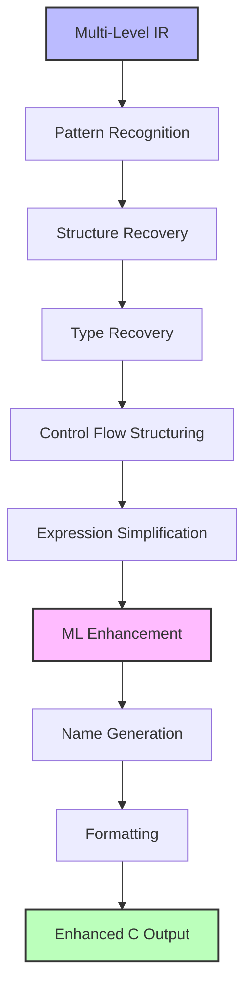

# Enhanced C Output Design and Implementation

## Overview

The Fireman decompiler produces Enhanced C code - a carefully designed subset of C11 with decompilation-specific
extensions. This document covers both the language specification and implementation strategy for generating readable,
accurate decompiled code.

## Part 1: Enhanced C Language Specification

### Philosophy: C with Decompilation Extensions

The output language is primarily C11 with:

- Carefully selected modern features for readability
- Decompiler-specific annotations for uncertainty and confidence
- Explicit handling of unknown or partially understood code
- Preservation of assembly-level details when needed

### Core Language: C11 Base

#### Base Features Used

```c
// Standard C types with explicit sizes (ALWAYS used)
uint8_t, uint16_t, uint32_t, uint64_t
int8_t, int16_t, int32_t, int64_t

// Compound literals for clarity
struct Point p = (struct Point){.x = 10, .y = 20};

// Designated initializers
int arr[] = {[0] = 1, [5] = 2, [9] = 3};

// Static assertions for invariants
_Static_assert(sizeof(Header) == 64, "Header size mismatch");
```

### Decompiler-Specific Extensions

#### 1. Confidence Markers

```c
// High confidence - no annotation needed
int32_t count = header->num_entries;

// Medium confidence 
int32_t __probable("loop_counter") i = 0;

// Low confidence
void* __uncertain ptr = *(void**)0x401000;

// Confidence on types
struct __confidence(0.85) FileHeader {
    uint32_t magic;
    uint32_t version;
};
```

#### 2. Unknown Type System

```c
// Completely unknown type
__unknown_t* opaque_ptr;
__unknown(256) buffer;  // 256 unknown bytes

// Partially known structures  
struct __partial struct_12 {
    uint32_t field_0;
    uint32_t field_4;
    __unknown(4) gap_8;  // 4 unknown bytes
    uint32_t field_c;
};
```

#### 3. Address Preservation

```c
// Original addresses in comments
int32_t value = *(int32_t*)0x401000;  /* @0x401000 */

// Function naming with addresses
void sub_401000(void);  /* Function at 0x401000 */

// Inline assembly for unrecoverable patterns
__asm_inline {
    // @0x401234: Original assembly preserved
    xor eax, eax
    cpuid
    mov dword ptr [rbx], eax
}
```

#### 4. ML Enhancement Annotations

```c
// ML-suggested variable names with confidence
int32_t dx;  /* ML suggested: "dx" (confidence: 0.75) */

// Pattern recognition markers
memcpy(dst, src, len);  /* Recognized pattern: rep movsb */

// Library function identification
malloc(size);  /* Pattern DB: libc malloc (confidence: 0.95) */
```

### Control Flow Representation

#### Structured Control Flow (Preferred)

```c
// Recovered loops with confidence tracking
for (int32_t i = 0; i < count; i++) {  /* confidence: 0.92 */
    process_item(items[i]);
}

// Recovered switches
switch (opcode) {
case 0x01: handle_add(); break;
case 0x02: handle_sub(); break;
default: handle_unknown(); break;
}
```

#### Goto for Irreducible Control Flow

```c
// When structure recovery fails
retry:  /* Irreducible loop @0x401100 */
    result = try_operation();
    if (result == RETRY) {
        if (++attempts < MAX_ATTEMPTS) {
            goto retry;
        }
    }

// Computed goto for jump tables
void* jump_table[] = {&&case_0, &&case_1, &&case_2};
goto *jump_table[index];  /* Indirect jump @0x401200 */
```

### Type System Features

#### Progressive Type Recovery

```c
// Stage 1: Raw memory access
*(uint32_t*)(base + 0x10) = value;

// Stage 2: Typed pointer  
((uint32_t*)base)[4] = value;

// Stage 3: Recovered structure
struct Data* data = (struct Data*)base;
data->field_10 = value;
```

#### Calling Convention Annotations

```c
// Explicit calling conventions preserved
void __stdcall api_function(int32_t param);
int32_t __fastcall optimized_func(int32_t a, int32_t b);
void __cdecl variadic_func(const char* fmt, ...);
```

## Part 2: Implementation Strategy

### Generation Pipeline



### AST Representation in Rust

```rust
use std::collections::BTreeMap;

/// Enhanced C Abstract Syntax Tree
#[derive(Debug, Clone)]
pub enum CStatement {
    /// Variable declaration with confidence
    Declaration {
        type_spec: CType,
        name: String,
        initializer: Option<Box<CExpr>>,
        confidence: Confidence,
        ml_suggestion: Option<MLSuggestion>,
    },

    /// Control flow with pattern info
    If {
        condition: Box<CExpr>,
        then_block: Vec<CStatement>,
        else_block: Option<Vec<CStatement>>,
        pattern: Option<PatternMatch>,
        confidence: Confidence,
    },

    /// Loops with recognition info
    For {
        init: Option<Box<CStatement>>,
        condition: Option<Box<CExpr>>,
        update: Option<Box<CExpr>>,
        body: Vec<CStatement>,
        pattern: LoopPattern,
        confidence: Confidence,
    },

    /// Decompiler-specific constructs
    InlineAsm {
        assembly: String,
        address: Address,
        reason: String,
    },

    UnknownBlock {
        size: usize,
        address: Address,
        bytes: Vec<u8>,
    },
}

#[derive(Debug, Clone)]
pub enum CType {
    // Standard types (fixed-width only)
    Void,
    Bool,
    Int8,
    Int16,
    Int32,
    Int64,
    UInt8,
    UInt16,
    UInt32,
    UInt64,
    Float32,
    Float64,

    // Pointer types
    Pointer(Box<CType>),

    // Enhanced C types
    Unknown,                    // __unknown_t
    UnknownSized(usize),       // __unknown(size)
    Partial(Box<CType>),       // __partial type
    Probable {                 // __probable type
        base: Box<CType>,
        confidence: f32,
        alternatives: Vec<CType>,
    },
}

#[derive(Debug, Clone)]
pub struct MLSuggestion {
    pub suggested_name: String,
    pub confidence: f32,
    pub model: String,
    pub rationale: Option<String>,
}

#[derive(Debug, Clone)]
pub struct PatternMatch {
    pub pattern_id: PatternId,
    pub confidence: f32,
    pub library: Option<String>,
    pub function: Option<String>,
}
```

### Pattern Recognition Engine

```rust
pub struct PatternRecognizer {
    /// Pattern database from pre-analysis
    pattern_db: PatternDatabase,

    /// ML models for pattern detection
    ml_models: Option<MLModels>,
}

impl PatternRecognizer {
    /// Recognize patterns across IR levels
    pub fn recognize(&mut self, ir: &IRModule) -> RecognizedPatterns {
        let mut patterns = RecognizedPatterns::new();

        // Low IR patterns (instruction sequences)
        for func in &ir.low_ir.functions {
            patterns.merge(self.recognize_instruction_patterns(func));
        }

        // Medium IR patterns (control flow)
        for func in &ir.medium_ir.functions {
            patterns.merge(self.recognize_control_patterns(func));
        }

        // High IR patterns (semantic)
        for func in &ir.high_ir.functions {
            patterns.merge(self.recognize_semantic_patterns(func));
        }

        // ML enhancement (if available)
        if let Some(ml) = &self.ml_models {
            patterns = ml.enhance_patterns(patterns);
        }

        patterns
    }

    /// Detect loop patterns
    fn recognize_loop_pattern(&self, blocks: &[MediumIRBlock]) -> Option<LoopPattern> {
        // Check for counted loop
        if let Some(pattern) = self.detect_counted_loop(blocks) {
            return Some(pattern);
        }

        // Check for while loop
        if let Some(pattern) = self.detect_while_loop(blocks) {
            return Some(pattern);
        }

        // Check for do-while
        if let Some(pattern) = self.detect_do_while(blocks) {
            return Some(pattern);
        }

        None
    }
}
```

### Expression Simplification

```rust
pub struct ExpressionSimplifier {
    /// Idiom database for pattern replacement
    idioms: IdiomDatabase,
}

impl ExpressionSimplifier {
    /// Simplify expressions while preserving semantics
    pub fn simplify(&self, expr: CExpr) -> CExpr {
        match expr {
            // Idiom recognition: x * 10 instead of ((x << 2) + x) << 1
            CExpr::BinaryOp { op: BinaryOp::Shl, lhs, rhs } => {
                if let Some(idiom) = self.recognize_multiplication_idiom(&lhs, &rhs) {
                    return idiom;
                }
                expr
            }

            // Pointer arithmetic to array indexing
            CExpr::Deref(box CExpr::BinaryOp {
                op: BinaryOp::Add,
                lhs: box CExpr::Variable(base),
                rhs: box offset
            }) => {
                // Convert *(base + offset) to base[offset]
                CExpr::Index {
                    array: Box::new(CExpr::Variable(base)),
                    index: Box::new(self.simplify(offset)),
                }
            }

            // Constant folding
            CExpr::BinaryOp { op, lhs, rhs } => {
                self.fold_constants(op, lhs, rhs)
            }

            _ => expr,
        }
    }
}
```

### ML-Enhanced Name Generation

```rust
pub struct NameGenerator {
    /// Traditional name generation
    symbols: BTreeMap<Address, String>,
    type_hints: BTreeMap<Address, TypeHint>,

    /// ML models for naming
    ml_naming: Option<MLNamingEngine>,

    /// Cache for determinism
    name_cache: BTreeMap<(Address, Context), NameSuggestion>,
}

impl NameGenerator {
    /// Generate variable name with ML enhancement
    pub fn generate_name(&mut self, addr: Address, context: &Context) -> NameSuggestion {
        // Check cache first (determinism)
        let cache_key = (addr, context.hash());
        if let Some(cached) = self.name_cache.get(&cache_key) {
            return cached.clone();
        }

        // Traditional name generation
        let traditional = self.generate_traditional_name(addr, context);

        // ML enhancement if available
        let suggestion = if let Some(ml) = &self.ml_naming {
            let ml_name = ml.suggest_name(context);
            if ml_name.confidence > 0.7 {
                NameSuggestion {
                    name: ml_name.name,
                    confidence: ml_name.confidence,
                    source: NameSource::ML(ml_name.model),
                    alternatives: vec![traditional],
                }
            } else {
                NameSuggestion {
                    name: traditional.clone(),
                    confidence: 0.5,
                    source: NameSource::Traditional,
                    alternatives: vec![ml_name.name],
                }
            }
        } else {
            NameSuggestion {
                name: traditional,
                confidence: 0.5,
                source: NameSource::Traditional,
                alternatives: vec![],
            }
        };

        // Cache result
        self.name_cache.insert(cache_key, suggestion.clone());
        suggestion
    }
}
```

### Output Formatter

```rust
pub struct EnhancedCFormatter {
    config: FormatterConfig,
    indent: usize,
    output: String,
}

impl EnhancedCFormatter {
    /// Format with confidence annotations
    pub fn format_statement(&mut self, stmt: &CStatement) {
        match stmt {
            CStatement::Declaration {
                type_spec, name, initializer, confidence, ml_suggestion
            } => {
                // Add confidence comment if not high
                if *confidence != Confidence::High {
                    self.write_comment(&format!("confidence: {:?}", confidence));
                }

                // Add ML suggestion if available
                if let Some(ml) = ml_suggestion {
                    self.write_comment(&format!(
                        "ML suggested: {} (confidence: {:.2})",
                        ml.suggested_name, ml.confidence
                    ));
                }

                // Write declaration
                self.write_indent();
                self.write_type(type_spec);
                self.write(" ");
                self.write(name);

                if let Some(init) = initializer {
                    self.write(" = ");
                    self.format_expr(init);
                }

                self.write(";");
                self.write_address_comment(stmt.address());
                self.newline();
            }

            CStatement::InlineAsm { assembly, address, reason } => {
                self.write_comment(&format!("Inline assembly: {}", reason));
                self.write_line("__asm_inline {");
                self.indent += 1;

                for line in assembly.lines() {
                    self.write_indent();
                    self.write_comment(&format!("@{:016x}", address));
                    self.write_line(line);
                }

                self.indent -= 1;
                self.write_line("}");
            }

            _ => { /* Other statement types */ }
        }
    }

    /// Format Enhanced C types
    fn write_type(&mut self, ty: &CType) {
        match ty {
            // Standard types
            CType::Int32 => self.write("int32_t"),
            CType::UInt64 => self.write("uint64_t"),

            // Enhanced C types
            CType::Unknown => self.write("__unknown_t"),
            CType::UnknownSized(size) => self.write(&format!("__unknown({})", size)),
            CType::Partial(inner) => {
                self.write("__partial ");
                self.write_type(inner);
            }
            CType::Probable { base, confidence, .. } => {
                self.write(&format!("__probable({:.2}) ", confidence));
                self.write_type(base);
            }

            _ => { /* Other types */ }
        }
    }
}
```

### Integration Example

```rust
pub struct EnhancedCGenerator {
    pattern_recognizer: PatternRecognizer,
    type_recovery: TypeRecoveryEngine,
    simplifier: ExpressionSimplifier,
    name_gen: NameGenerator,
    formatter: EnhancedCFormatter,
}

impl EnhancedCGenerator {
    /// Generate Enhanced C from multi-level IR
    pub fn generate(&mut self, module: &IRModule) -> String {
        let mut output = String::new();

        // Add file header
        output.push_str(&self.generate_header(module));

        // Process each function
        for (addr, func) in &module.high_ir.functions {
            // Phase 1: Pattern recognition across all IR levels
            let patterns = self.pattern_recognizer.recognize_function(
                &module.low_ir.functions[addr],
                &module.medium_ir.functions[addr],
                func
            );

            // Phase 2: Type recovery with ML enhancement
            let types = self.type_recovery.recover_types(func, &patterns);

            // Phase 3: Convert to Enhanced C AST
            let mut ast = self.ir_to_ast(func, &types, &patterns);

            // Phase 4: Simplify expressions
            ast = self.simplifier.simplify_all(ast);

            // Phase 5: Generate names with ML
            self.name_gen.generate_all_names(&mut ast);

            // Phase 6: Format output
            output.push_str(&self.formatter.format_function(func, ast));
        }

        output
    }

    fn generate_header(&self, module: &IRModule) -> String {
        format!(
            "/*\n\
             * Decompiled by Fireman v{}\n\
             * Source: {}\n\
             * Architecture: {}\n\
             * Timestamp: {}\n\
             * Overall confidence: {:.2}\n\
             */\n\n",
            env!("CARGO_PKG_VERSION"),
            module.source_file,
            module.architecture,
            module.timestamp,
            module.confidence_score()
        )
    }
}
```

## Output Examples

### Simple Function with High Confidence

```c
/* Function at 0x401000 - confidence: 0.95 */
int32_t calculate_sum(int32_t* array, int32_t count) {
    int32_t sum = 0;  /* ML suggested: "sum" (confidence: 0.92) */
    
    for (int32_t i = 0; i < count; i++) {  /* Recognized: counted loop */
        sum += array[i];
    }
    
    return sum;
}
```

### Complex Function with Uncertainty

```c
/* Function at 0x402000 - confidence: 0.62 */
void* __uncertain process_data(
    __probable(0.78) uint8_t* data,      /* ML suggested: "input_buffer" */
    __probable(0.81) uint32_t size,      /* ML suggested: "buffer_size" */
    __unknown_t* context
) {
    /* Check magic number @0x402003 */
    if (*(uint32_t*)data != 0x12345678) [[unlikely]] {
        return nullptr;
    }
    
    /* Partially recovered structure @0x402010 */
    struct __partial __confidence(0.73) Header {
        uint32_t magic;
        uint32_t version;
        __unknown(8) reserved;
        uint32_t data_offset;
    } *header = (struct Header*)data;
    
    /* Pattern match: switch table @0x402030 */
    switch (header->version) {
    case 1:
        return process_v1(data + header->data_offset);
    case 2:
        return process_v2(data + header->data_offset);
    default:
        /* Inline assembly: unknown pattern @0x402050 */
        __asm_inline {
            "mov rax, [rdi+0x20]"
            "call rax"
        }
        return nullptr;
    }
}
```

### Recognized Library Function

```c
/* Pattern DB: CRC32 implementation @0x403000 (confidence: 0.98) */
uint32_t crc32_calculate(const uint8_t* data, size_t length) {
    /* Recognized: standard CRC32 polynomial table */
    static const uint32_t crc_table[256] = {
        0x00000000, 0x77073096, /* ... */
    };
    
    uint32_t crc = 0xFFFFFFFF;
    
    /* Recognized: CRC32 main loop */
    for (size_t i = 0; i < length; i++) {
        uint8_t index = (crc ^ data[i]) & 0xFF;
        crc = (crc >> 8) ^ crc_table[index];
    }
    
    return ~crc;
}
```

## Design Principles

1. **Determinism First**: Same binary always produces same output
2. **Progressive Enhancement**: Start with direct translation, improve with confidence
3. **Explicit Uncertainty**: Never hide what we don't know
4. **ML as Enhancement**: Traditional analysis enhanced (not replaced) by ML
5. **Human Readability**: Optimize for human understanding while preserving accuracy
6. **Reversibility**: Maintain clear mapping back to original assembly

This approach produces immediately useful output that improves progressively as analysis deepens, while always
maintaining correctness and determinism.