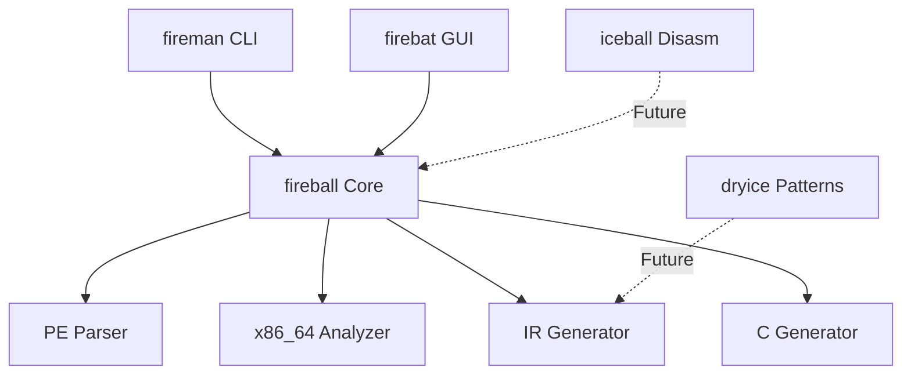
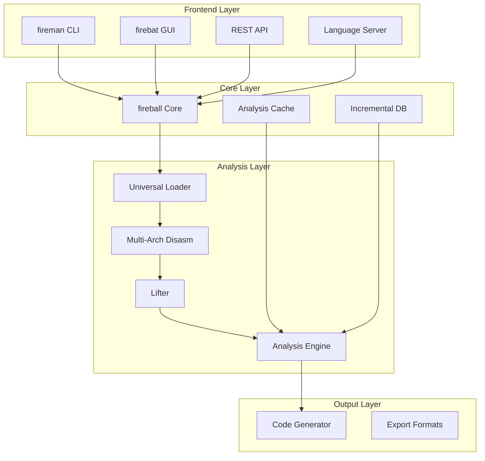

# Fireman Implementation Strategy

## Project Architecture Evolution

### Current State Analysis



### Target Architecture



## Implementation Phases

### Phase 1: Foundation Improvements (Current Sprint)

#### 1.1 Enhance Binary Loading
```rust
// Migrate from owned Vec to zero-copy
pub struct PEFile {
    // OLD:
    // data: Vec<u8>,
    
    // NEW:
    mmap: Mmap,
    header: PEHeader,
    sections: Vec<SectionView<'_>>,
}

impl PEFile {
    pub fn parse_zero_copy(mmap: Mmap) -> Result<Self> {
        // Parse without allocating
        let header = PEHeader::from_bytes(&mmap)?;
        let sections = Self::parse_sections(&mmap, &header)?;
        
        Ok(Self { mmap, header, sections })
    }
}
```

#### 1.2 Improve Instruction Analysis
```rust
// Current: Sequential analysis
// Target: Parallel with caching

use dashmap::DashMap;

pub struct InstructionCache {
    decoded: DashMap<Address, Instruction>,
    lifted: DashMap<Address, Vec<IR>>,
}

impl X86Analyzer {
    pub fn analyze_parallel(&self, addresses: Vec<Address>) -> Vec<Block> {
        addresses.par_iter()
            .map(|&addr| self.analyze_from(addr))
            .collect()
    }
}
```

#### 1.3 Optimize IR Generation
```rust
// Add builder pattern for type safety
pub struct IRBuilder<'a> {
    arena: &'a Bump,
    current_block: BlockId,
    statements: Vec<IR>,
}

impl<'a> IRBuilder<'a> {
    pub fn load(&mut self, dst: Reg, addr: Expr) -> &mut Self {
        self.statements.push(IR::Load { dst, addr });
        self
    }
    
    pub fn store(&mut self, addr: Expr, src: Reg) -> &mut Self {
        self.statements.push(IR::Store { addr, src });
        self
    }
}
```

### Phase 2: Multi-Architecture Support

#### 2.1 Architecture Trait System
```rust
pub trait Architecture: Send + Sync {
    type Instruction: Instruction;
    type Register: Register;
    type Decoder: Decoder<Self::Instruction>;
    
    fn decoder(&self) -> Self::Decoder;
    fn lifter(&self) -> Box<dyn Lifter<Self::Instruction>>;
    fn analyzer(&self) -> Box<dyn Analyzer>;
}

pub struct X86_64;
impl Architecture for X86_64 {
    type Instruction = X86Instruction;
    type Register = X86Register;
    type Decoder = X86Decoder;
    
    // Implementation...
}

pub struct AArch64;
impl Architecture for AArch64 {
    type Instruction = ArmInstruction;
    type Register = ArmRegister;
    type Decoder = ArmDecoder;
    
    // Implementation...
}
```

#### 2.2 Universal Binary Loader
```rust
pub enum BinaryFormat {
    PE(PEFile),
    ELF(ELFFile),
    MachO(MachOFile),
    Raw(RawBinary),
}

pub trait BinaryLoader {
    fn detect_format(data: &[u8]) -> Option<FormatType>;
    fn load(path: &Path) -> Result<BinaryFormat>;
    fn architecture(&self) -> Box<dyn Architecture>;
}
```

### Phase 3: Advanced Analysis

#### 3.1 Incremental Analysis with Salsa
```rust
#[salsa::query_group(DecompilerStorage)]
pub trait DecompilerQueries {
    #[salsa::input]
    fn binary_path(&self) -> PathBuf;
    
    #[salsa::memoized]
    fn binary(&self) -> Arc<Binary>;
    
    #[salsa::memoized]
    fn functions(&self) -> Arc<Vec<Function>>;
    
    #[salsa::memoized]
    fn cfg(&self, func: FunctionId) -> Arc<ControlFlowGraph>;
    
    #[salsa::memoized]
    fn types(&self, func: FunctionId) -> Arc<TypeMap>;
    
    #[salsa::memoized]
    fn decompiled(&self, func: FunctionId) -> Arc<HighLevelCode>;
}
```

#### 3.2 Parallel Analysis Pipeline
```rust
pub struct AnalysisPipeline {
    stages: Vec<Box<dyn AnalysisStage>>,
    scheduler: WorkStealingScheduler,
}

impl AnalysisPipeline {
    pub async fn analyze(&self, binary: &Binary) -> AnalysisResult {
        // Find entry points
        let entries = self.find_entries(binary).await?;
        
        // Parallel function discovery
        let functions = entries
            .par_iter()
            .flat_map(|e| self.discover_functions(e))
            .collect();
        
        // Parallel analysis stages
        let results = stream::iter(functions)
            .map(|f| self.analyze_function(f))
            .buffer_unordered(num_cpus::get())
            .collect()
            .await;
        
        Ok(AnalysisResult { results })
    }
}
```

### Phase 4: Language-Specific Enhancements

#### 4.1 Rust Binary Support
```rust
pub struct RustAnalyzer {
    pattern_db: RustPatternDB,
    type_recoverer: RustTypeRecoverer,
}

impl RustAnalyzer {
    pub fn recover_types(&self, func: &Function) -> TypedFunction {
        // Identify Rust-specific patterns
        let patterns = self.pattern_db.match_all(func);
        
        // Recover ownership information
        let ownership = self.analyze_ownership(func, &patterns);
        
        // Reconstruct high-level types
        self.type_recoverer.recover(func, ownership)
    }
}
```

#### 4.2 Go Binary Support
```rust
pub struct GoAnalyzer {
    runtime_analyzer: GoRuntimeAnalyzer,
    goroutine_tracker: GoroutineTracker,
}

impl GoAnalyzer {
    pub fn analyze_function(&self, addr: Address) -> GoFunction {
        // Parse pclntab entry
        let meta = self.runtime_analyzer.parse_func_meta(addr);
        
        // Track goroutine operations
        let goroutines = self.goroutine_tracker.track(addr);
        
        GoFunction { meta, goroutines }
    }
}
```

### Phase 5: GUI Enhancement

#### 5.1 Real-time Analysis Updates
```rust
// Tauri command for streaming updates
#[tauri::command]
async fn analyze_binary(
    path: String,
    state: State<'_, AnalysisState>,
) -> Result<impl Stream<Item = AnalysisUpdate>> {
    let analyzer = state.analyzer.lock().await;
    
    Ok(async_stream::stream! {
        let binary = Binary::load(&path).await?;
        
        // Stream progress updates
        yield AnalysisUpdate::Loading(0.0);
        
        // Stream function discoveries
        let mut progress = 0.0;
        for func in analyzer.discover_functions(&binary) {
            yield AnalysisUpdate::FunctionFound(func);
            progress += 0.1;
            yield AnalysisUpdate::Progress(progress);
        }
        
        // Stream analysis results
        for result in analyzer.analyze_all(&binary).await {
            yield AnalysisUpdate::Result(result);
        }
    })
}
```

#### 5.2 Interactive Decompilation
```tsx
// React component for interactive analysis
const InteractiveDecompiler: React.FC = () => {
    const [selectedFunction, setSelectedFunction] = useState<Function>();
    const [irView, setIrView] = useState<IRView>('high');
    const [optimization, setOptimization] = useState<OptLevel>('normal');
    
    const { data: decompiled, refetch } = useQuery(
        ['decompile', selectedFunction, optimization],
        () => invoke('decompile_function', {
            funcId: selectedFunction?.id,
            optimization,
        })
    );
    
    return (
        <SplitPane>
            <AssemblyView function={selectedFunction} />
            <IRView level={irView} data={decompiled?.ir} />
            <CCodeView code={decompiled?.code} />
        </SplitPane>
    );
};
```

## Performance Targets

### Benchmarks
```rust
#[bench]
fn bench_pe_parsing(b: &mut Bencher) {
    let data = include_bytes!("../tests/samples/large.exe");
    b.iter(|| {
        let _ = PEFile::parse(black_box(data));
    });
}

#[bench]
fn bench_parallel_cfg(b: &mut Bencher) {
    let binary = setup_test_binary();
    b.iter(|| {
        let _ = analyze_cfg_parallel(black_box(&binary));
    });
}
```

### Performance Goals
- PE parsing: < 10ms for 100MB binary
- CFG construction: 10K blocks/second
- Type inference: 1K functions/second
- Memory usage: < 10x binary size

## Testing Strategy

### Unit Tests
```rust
#[cfg(test)]
mod tests {
    use proptest::prelude::*;
    
    proptest! {
        #[test]
        fn test_instruction_roundtrip(bytes in prop::collection::vec(any::<u8>(), 1..15)) {
            if let Some(inst) = decode_instruction(&bytes) {
                let encoded = encode_instruction(&inst);
                assert_eq!(bytes[..inst.len()], encoded);
            }
        }
    }
}
```

### Integration Tests
```rust
#[test]
fn test_full_decompilation() {
    let binary = Binary::load("tests/samples/hello_world.exe").unwrap();
    let result = decompile(&binary).unwrap();
    
    assert!(result.functions.len() > 0);
    assert!(result.has_main());
    
    // Snapshot testing for output stability
    insta::assert_snapshot!(result.to_c_code());
}
```

## Roadmap

### Q1 2025
- [x] Core architecture refactoring
- [ ] Zero-copy binary loading
- [ ] Parallel instruction analysis
- [ ] Basic ARM64 support

### Q2 2025
- [ ] Incremental analysis
- [ ] Advanced type inference
- [ ] Go binary support
- [ ] Rust binary support

### Q3 2025
- [ ] Plugin system
- [ ] REST API
- [ ] Language server protocol
- [ ] Advanced GUI features

### Q4 2025
- [ ] Distributed analysis
- [ ] ML-assisted decompilation
- [ ] Production release