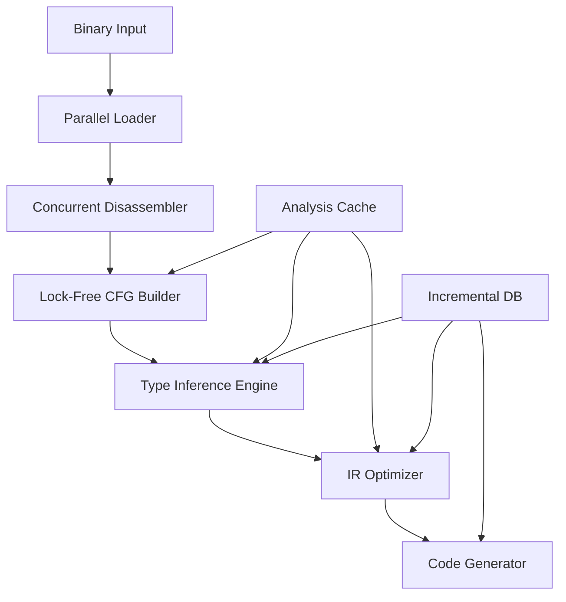

# Rust-Optimized Decompiler Architecture

## Core Design Principles

### 1. Zero-Copy Architecture

```rust
use bstr::ByteSlice;
use memmap2::Mmap;

/// Zero-copy binary representation
pub struct Binary {
    /// Memory-mapped file for efficient access
    mmap: Mmap,
    
    /// Views into the mapped memory
    sections: Vec<SectionView>,
    
    /// String table without allocation
    strings: StringTable<'static>,
}

/// Section view without copying
pub struct SectionView {
    name: &'static str,
    data: &'static [u8],
    addr: VirtualAddress,
    perms: Permissions,
}

impl Binary {
    /// Load binary with zero copies
    pub fn load(path: impl AsRef<Path>) -> Result<Self> {
        let file = File::open(path)?;
        let mmap = unsafe { Mmap::map(&file)? };
        
        // Parse headers without copying
        let binary = Self::parse_zero_copy(&mmap)?;
        
        // Transmute lifetime for zero-copy views
        Ok(unsafe { std::mem::transmute(binary) })
    }
}
```

### 2. Lock-Free Parallel Analysis

```rust
use crossbeam::epoch::{self, Atomic, Owned};
use dashmap::DashMap;
use rayon::prelude::*;

/// Lock-free function analysis cache
pub struct AnalysisCache {
    /// Concurrent function map
    functions: DashMap<Address, Arc<Function>>,
    
    /// Lock-free CFG updates
    cfg_nodes: DashMap<BlockId, Atomic<CFGNode>>,
    
    /// Work-stealing queue for analysis tasks
    work_queue: crossbeam::deque::Injector<AnalysisTask>,
}

impl AnalysisCache {
    /// Parallel function analysis
    pub fn analyze_parallel(&self, entries: Vec<Address>) {
        entries.par_iter()
            .map(|&addr| self.analyze_function(addr))
            .collect::<Vec<_>>();
    }
    
    /// Lock-free CFG construction
    pub fn update_cfg(&self, block_id: BlockId, update: CFGUpdate) {
        let guard = &epoch::pin();
        
        loop {
            let node = self.cfg_nodes.get(&block_id).unwrap();
            let current = node.load(SeqCst, guard);
            
            let new_node = current.update(update);
            
            match node.compare_exchange(
                current,
                Owned::new(new_node),
                SeqCst,
                SeqCst,
                guard,
            ) {
                Ok(_) => break,
                Err(_) => continue, // Retry
            }
        }
    }
}
```

### 3. Type-Safe IR with GATs

```rust
/// Type-safe IR with Generic Associated Types
pub trait IRNode: Sized {
    type Operand: OperandType;
    type Result: ResultType;
    
    /// Type-safe operation execution
    fn execute(&self, operands: &[Self::Operand]) -> Self::Result;
}

/// Phantom types for compile-time guarantees
pub struct Typed<T, V> {
    value: V,
    _phantom: PhantomData<T>,
}

/// Type-safe IR builder
pub struct IRBuilder<'a> {
    current_block: &'a mut BasicBlock,
    type_env: TypeEnvironment,
}

impl<'a> IRBuilder<'a> {
    /// Build with type checking
    pub fn build_add<T: Numeric>(
        &mut self,
        lhs: Typed<T, Operand>,
        rhs: Typed<T, Operand>,
    ) -> Typed<T, Value> {
        let result = self.current_block.push(IR::Add {
            lhs: lhs.value,
            rhs: rhs.value,
            ty: T::ir_type(),
        });
        
        Typed::new(result)
    }
}
```

### 4. Arena-Based Memory Management

```rust
use typed_arena::Arena;
use bumpalo::Bump;

/// Hierarchical arena allocation
pub struct DecompilerArenas {
    /// Long-lived allocations (entire analysis)
    global: Arena<Node>,
    
    /// Function-scoped allocations
    function: Bump,
    
    /// Block-scoped allocations
    block: Bump,
}

/// Arena-allocated AST
pub struct ASTBuilder<'a> {
    arena: &'a Bump,
}

impl<'a> ASTBuilder<'a> {
    /// Allocate in arena - no cleanup needed
    pub fn expr(&self, kind: ExprKind) -> &'a Expr<'a> {
        self.arena.alloc(Expr {
            kind,
            ty: None,
            metadata: Metadata::default(),
        })
    }
    
    /// Build entire tree in arena
    pub fn build_function(&self, ir: &IR) -> &'a Function<'a> {
        self.arena.alloc(Function {
            name: self.arena.alloc_str(&ir.name),
            params: self.build_params(ir),
            body: self.build_body(ir),
            return_type: self.infer_return_type(ir),
        })
    }
}
```

### 5. Const Generics for Performance

```rust
/// Fixed-size analysis with const generics
pub struct RegisterFile<const N: usize> {
    regs: [RegisterState; N],
}

impl<const N: usize> RegisterFile<N> {
    /// Compile-time bounds checking
    pub const fn get<const I: usize>(&self) -> &RegisterState {
        assert!(I < N);
        &self.regs[I]
    }
    
    /// SIMD-friendly operations
    pub fn clear_all(&mut self) {
        // Compiler can vectorize this
        self.regs = [RegisterState::Unknown; N];
    }
}

/// Architecture-specific register counts
type X86RegisterFile = RegisterFile<16>;   // General purpose
type ARMRegisterFile = RegisterFile<31>;   // X0-X30
```

### 6. Async I/O for Large Binaries

```rust
use tokio::io::{AsyncReadExt, AsyncSeekExt};
use futures::stream::{Stream, StreamExt};

/// Streaming binary analysis
pub struct AsyncBinaryReader {
    file: tokio::fs::File,
    cache: lru::LruCache<ChunkId, Bytes>,
}

impl AsyncBinaryReader {
    /// Stream sections for analysis
    pub fn stream_sections(&mut self) -> impl Stream<Item = Result<Section>> {
        async_stream::stream! {
            let header = self.read_header().await?;
            
            for section_info in header.sections {
                // Read section asynchronously
                let data = self.read_section(&section_info).await?;
                yield Ok(Section { info: section_info, data });
            }
        }
    }
    
    /// Parallel section analysis
    pub async fn analyze_sections_parallel(&mut self) -> Result<Vec<Analysis>> {
        let sections = self.stream_sections()
            .collect::<Vec<_>>()
            .await;
        
        // Process in parallel
        let analyses = sections
            .into_par_iter()
            .map(|section| analyze_section(section?))
            .collect::<Result<Vec<_>>>()?;
        
        Ok(analyses)
    }
}
```

### 7. Custom Allocators for Hot Paths

```rust
use mimalloc::MiMalloc;
use smallvec::SmallVec;

/// Use MiMalloc for better performance
#[global_allocator]
static GLOBAL: MiMalloc = MiMalloc;

/// Stack-allocated vectors for small data
pub type SmallInstructionVec = SmallVec<[Instruction; 8]>;
pub type SmallOperandVec = SmallVec<[Operand; 4]>;

/// Custom allocator for IR nodes
pub struct IRAllocator {
    /// Pools for common sizes
    pools: [Pool; 16],
    
    /// Fallback allocator
    fallback: Bump,
}

impl IRAllocator {
    /// Fast allocation for common IR nodes
    pub fn alloc<T: IRNode>(&self) -> &mut T {
        let size = size_of::<T>();
        
        if let Some(pool) = self.pool_for_size(size) {
            unsafe { pool.alloc() }
        } else {
            self.fallback.alloc(T::default())
        }
    }
}
```

### 8. SIMD-Accelerated Pattern Matching

```rust
use packed_simd_2::*;

/// SIMD pattern matcher
pub struct SimdPatternMatcher {
    patterns: Vec<SimdPattern>,
}

/// SIMD-friendly pattern representation
#[repr(align(32))]
pub struct SimdPattern {
    mask: u8x32,
    value: u8x32,
}

impl SimdPatternMatcher {
    /// Vectorized pattern search
    pub fn find_patterns(&self, data: &[u8]) -> Vec<Match> {
        let mut matches = Vec::new();
        
        // Process 32 bytes at a time
        for (offset, chunk) in data.chunks_exact(32).enumerate() {
            let chunk_simd = u8x32::from_slice_unaligned(chunk);
            
            for pattern in &self.patterns {
                // SIMD comparison
                let masked = chunk_simd & pattern.mask;
                if masked == pattern.value {
                    matches.push(Match {
                        offset: offset * 32,
                        pattern_id: pattern.id,
                    });
                }
            }
        }
        
        matches
    }
}
```

### 9. Incremental Computation with Salsa

```rust
use salsa;

/// Incremental decompilation database
#[salsa::database(
    BinaryStorage,
    AnalysisStorage,
    DecompilationStorage
)]
pub struct DecompilerDatabase {
    storage: salsa::Storage<Self>,
}

/// Queries for incremental computation
#[salsa::query_group(AnalysisStorage)]
pub trait AnalysisQueries {
    /// Cached CFG construction
    #[salsa::dependencies]
    fn cfg(&self, function: FunctionId) -> Arc<ControlFlowGraph>;
    
    /// Incremental type inference
    #[salsa::dependencies]
    fn inferred_types(&self, function: FunctionId) -> Arc<TypeMap>;
    
    /// Cached decompilation result
    fn decompile(&self, function: FunctionId) -> Arc<HighLevelCode>;
}
```

### 10. Error Handling with Types

```rust
use thiserror::Error;

/// Type-safe error handling
#[derive(Error, Debug)]
pub enum DecompileError {
    #[error("Invalid instruction at {addr:#x}: {bytes:?}")]
    InvalidInstruction { addr: Address, bytes: Vec<u8> },
    
    #[error("Type inference failed: {reason}")]
    TypeInference { reason: String },
    
    #[error("Unsupported architecture: {arch}")]
    UnsupportedArch { arch: Architecture },
}

/// Result type with rich errors
pub type DecompileResult<T> = Result<T, DecompileError>;

/// Fallible operations with context
pub trait FallibleDecompile {
    type Output;
    
    fn decompile_with_context(
        &self,
        ctx: &mut Context,
    ) -> DecompileResult<Self::Output>;
}
```

## Architecture Components

### Core Pipeline



### Module Organization

```rust
pub mod core {
    pub mod binary;     // Zero-copy binary handling
    pub mod address;    // Address space management
    pub mod memory;     // Memory-mapped I/O
}

pub mod arch {
    pub mod x86_64;     // x86-64 support
    pub mod aarch64;    // ARM64 support
    pub mod wasm;       // WebAssembly support
    
    pub trait Architecture {
        type Instruction: InstructionType;
        type Register: RegisterType;
        
        fn decode(&self, bytes: &[u8]) -> Option<Self::Instruction>;
        fn lift(&self, inst: &Self::Instruction) -> Vec<IR>;
    }
}

pub mod analysis {
    pub mod cfg;        // Control flow graph
    pub mod dfa;        // Data flow analysis
    pub mod types;      // Type inference
    pub mod symbolic;   // Symbolic execution
}

pub mod ir {
    pub mod builder;    // Type-safe IR construction
    pub mod optimizer;  // Optimization passes
    pub mod lowering;   // IR to high-level code
}

pub mod output {
    pub mod c;          // C code generation
    pub mod rust;       // Rust code generation
    pub mod ast;        // Generic AST
}
```

## Performance Optimizations

### 1. Profile-Guided Optimization
```toml
[profile.release]
lto = "fat"
codegen-units = 1
panic = "abort"
```

### 2. CPU Feature Detection
```rust
#[cfg(target_arch = "x86_64")]
pub fn select_decoder() -> Box<dyn Decoder> {
    if is_x86_feature_detected!("avx2") {
        Box::new(AVX2Decoder::new())
    } else if is_x86_feature_detected!("sse4.2") {
        Box::new(SSE42Decoder::new())
    } else {
        Box::new(ScalarDecoder::new())
    }
}
```

### 3. Custom Benchmarks
```rust
use criterion::{black_box, criterion_group, criterion_main, Criterion};

fn benchmark_cfg_construction(c: &mut Criterion) {
    c.bench_function("cfg_construction", |b| {
        b.iter(|| {
            let cfg = build_cfg(black_box(&function_bytes));
            black_box(cfg);
        })
    });
}

criterion_group!(benches, benchmark_cfg_construction);
criterion_main!(benches);
```

## Future Enhancements

1. **GPU Acceleration**: CUDA/Vulkan compute for parallel analysis
2. **Distributed Analysis**: Multi-machine decompilation
3. **Real-time Collaboration**: Concurrent multi-user analysis
4. **Plugin System**: Dynamic loading of architecture modules
5. **Machine Learning Integration**: Neural decompilation assistants