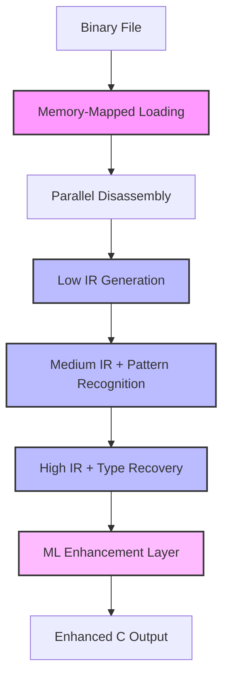

# Decompiler Fundamentals

## Core Concepts

### Fireman Decompilation Pipeline



### Multi-Level IR Architecture

The Fireman decompiler uses a progressive three-level IR design:

1. **Low IR**: Direct instruction translation, preserves all semantics
2. **Medium IR**: Pattern recognition, basic optimizations, confidence tracking
3. **High IR**: Near-source representation with recovered types and structures

Each level maintains **absolute determinism** - the same binary input ALWAYS produces identical output.

### 1. Binary File Formats

#### PE (Portable Executable) - Windows
- **Structure**: DOS Header → PE Header → Section Headers → Sections
- **Key Components**:
  - Import/Export tables
  - Relocation information
  - Debug information (PDB)
  - Resource sections
  - TLS (Thread Local Storage)

#### ELF (Executable and Linkable Format) - Linux/Unix
- **Structure**: ELF Header → Program Headers → Section Headers → Sections
- **Key Components**:
  - Dynamic linking information
  - Symbol tables
  - DWARF debug info
  - GOT/PLT for dynamic linking
  - .init/.fini sections

#### Mach-O - macOS/iOS
- **Structure**: Mach Header → Load Commands → Segments → Sections
- **Key Components**:
  - LC_SYMTAB for symbols
  - LC_DYSYMTAB for dynamic symbols
  - Code signing information
  - Fat binaries (multiple architectures)

### 2. Instruction Set Architectures

#### x86_64 Analysis
- **Complex Instruction Characteristics**:
  - Variable-length encoding (1-15 bytes)
  - Prefix bytes modify behavior
  - ModR/M and SIB bytes for addressing
  - Multiple instruction sets (SSE, AVX, etc.)

#### ARM64/AArch64
- **Fixed-width Instructions**: 32-bit encoding
- **Predication**: Conditional execution
- **SIMD**: NEON instructions
- **Security**: Pointer authentication

#### WebAssembly (WASM)
- **Stack Machine**: Type-safe bytecode
- **Structured Control Flow**: No arbitrary jumps
- **Memory Model**: Linear memory with bounds checking

### 3. Intermediate Representation (IR)

#### Multi-Level IR Design
```rust
enum IRLevel {
    Low,     // Close to machine code
    Medium,  // Basic optimizations
    High,    // Near source level
}

struct IRStatement {
    level: IRLevel,
    operation: Operation,
    operands: Vec<Operand>,
    metadata: Metadata,
}
```

#### IR Operations
- **Memory**: Load, Store, Alloca
- **Arithmetic**: Add, Sub, Mul, Div, Mod
- **Logic**: And, Or, Xor, Not
- **Control**: Jump, Branch, Call, Return
- **Comparison**: Eq, Ne, Lt, Le, Gt, Ge

### 4. Data Flow Analysis

#### Static Single Assignment (SSA)
```rust
// Traditional form
x = 5;
y = x + 1;
x = 7;
z = x + y;

// SSA form
x₁ = 5;
y₁ = x₁ + 1;
x₂ = 7;
z₁ = x₂ + y₁;
```

#### Phi Functions
```rust
// CFG merge points
if condition {
    x₁ = 5;
} else {
    x₂ = 10;
}
x₃ = φ(x₁, x₂);  // Phi function
```

### 5. Type Reconstruction

#### Type Inference Strategies
1. **Instruction-based**: MOV EAX, [RBX] → RBX is pointer
2. **API-based**: malloc return → void pointer
3. **Propagation**: Follow data flow
4. **Constraint solving**: Build type equations

#### Advanced Type Recovery
- **Polymorphic types**: Templates, generics
- **Virtual tables**: C++ class hierarchies
- **Tagged unions**: Rust enums, C unions
- **Function pointers**: Callbacks, vtables

### 6. Control Flow Reconstruction

#### Basic Block Identification
```rust
struct BasicBlock {
    start_addr: u64,
    end_addr: u64,
    instructions: Vec<Instruction>,
    successors: Vec<BlockId>,
    predecessors: Vec<BlockId>,
    dominator: Option<BlockId>,
}
```

#### Advanced CFG Patterns
- **Indirect Jumps**: Jump tables, virtual calls
- **Exception Handling**: SEH, C++ exceptions, setjmp/longjmp
- **Tail Calls**: Optimized function calls
- **Hot/Cold Splitting**: Profile-guided optimization artifacts

### 7. Optimization Techniques

#### Peephole Optimizations
```rust
// Before
PUSH EAX
POP EBX

// After
MOV EBX, EAX
```

#### Dead Code Elimination
```rust
// Identify unreachable code
// Remove stores to unused variables
// Eliminate side-effect-free computations
```

#### Constant Propagation
```rust
// Before
x = 5;
y = x + 3;
z = y * 2;

// After
x = 5;
y = 8;
z = 16;
```

### 8. Pattern Recognition

#### Compiler Idioms
- **Loop patterns**: for, while, do-while
- **Switch tables**: Jump table implementations
- **String operations**: strlen, strcpy patterns
- **Calling conventions**: cdecl, stdcall, fastcall

#### Library Function Identification
- **Signature matching**: Byte patterns
- **Behavior analysis**: Side effects
- **Import reconstruction**: Dynamic linking
- **FLIRT signatures**: IDA-style matching

### 9. Advanced Techniques

#### Symbolic Execution
```rust
struct SymbolicState {
    constraints: Vec<Constraint>,
    memory: SymbolicMemory,
    registers: SymbolicRegisters,
}
```

#### Abstract Interpretation
- **Value analysis**: Range tracking
- **Pointer analysis**: Alias analysis
- **Taint analysis**: Data flow tracking

#### Machine Learning Applications
- **Function boundary detection**
- **Compiler identification**
- **Optimization level detection**
- **Code similarity matching**

### 10. Challenges and Solutions

#### Anti-Analysis Techniques
- **Obfuscation**: Code flattening, opaque predicates
- **Packing**: Runtime unpacking
- **Virtualization**: VM-based protection
- **Anti-debugging**: Timing checks, debugger detection

#### Solutions
- **Dynamic analysis**: Runtime monitoring
- **Emulation**: Safe execution environment
- **Pattern matching**: Known obfuscation patterns
- **Heuristics**: Statistical analysis

## Best Practices

### Correctness Over Completeness
- Prefer accurate partial decompilation
- Mark uncertain regions
- Provide confidence levels

### Performance Optimization
- **Lazy analysis**: On-demand processing
- **Caching**: Reuse computations
- **Parallelization**: Independent function analysis
- **Incremental updates**: Partial reanalysis

### User Experience
- **Progressive disclosure**: Start with overview
- **Interactive exploration**: Drill-down capability
- **Cross-references**: Navigation aids
- **Annotations**: User and automatic