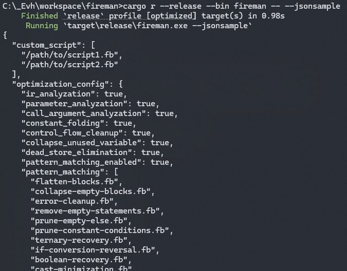
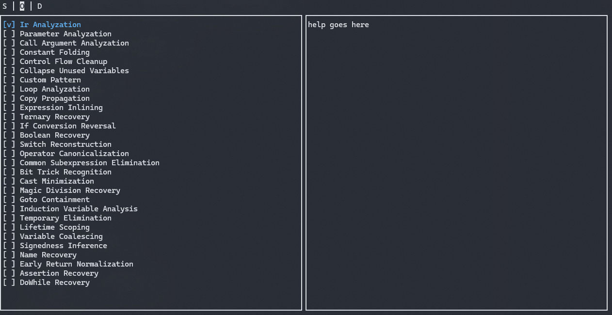

# Fireman CLI & TUI

## CLI

### CLI Examples

```bash
fireman -i example.exe 
```

```bash
fireman -i example.exe --script myscript.fb --script myscript2.fb
```

```bash
fireman example.exe --json preset.json
```

```bash
fireman --jsonsample
```




## TUI

F1 to helps

```bash
fireman --tui
```

```bash
fireman --tui example.exe
```

```bash
fireman --tui --json preset.json
```

```bash
fireman --tui --json preset.json -i example.exe
```





### TUI known issues

- No help text for optimizations
- Custom script and pattern matching from args doesn't work
- Crashes sometimes...
